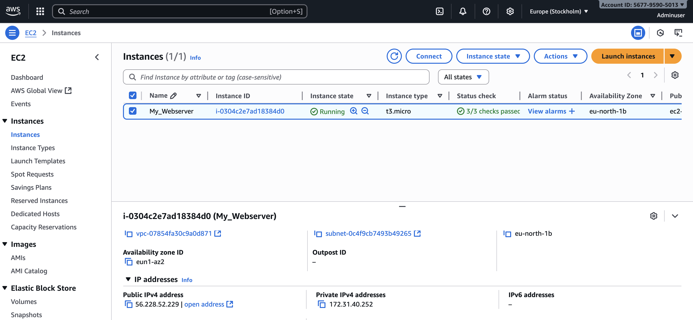
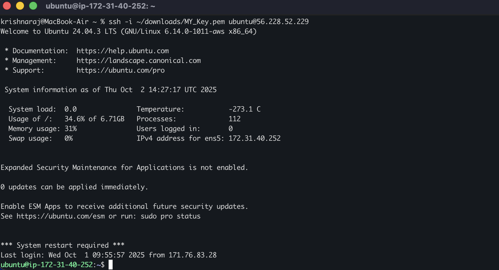
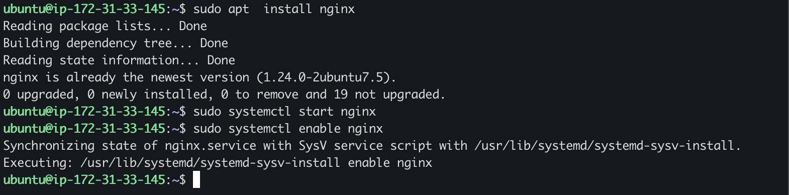
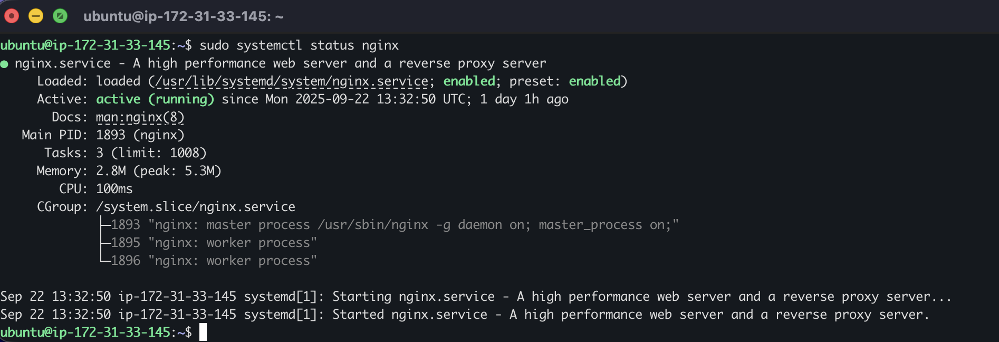

# EC2 + Nginx Web Hosting
## Overview
- This project demonstrates how to launch EC2 instance on AWS and configure it via SSH installing Nginx to launch a simple web hosting service
## Skills & Tools
- AWS (Free trial) EC2 
- Ubuntu AMI
- Configuring Security groups (Port 22 & 80) 
- Desktop: Windows or MAC 
- Nginx
- Terminal / Iterm2
- HTML Script 
## Steps
### 1. Launch EC2 Instance
- Choose Ubuntu AMI (Amazon Machine Image)
- Select t3.micro as instance type ( Eligible for free trial )
- Create a new key pair and download 
- In Network settings create a new security group while allowing SSH and HTTP traffic
- Keep the storage as default 8 GB gp3 volume and avoid creating new volume unless it is required in the future so that it won't exceed the 30 GB monthly allotted memory 
- Launch the instance 
### 2.Connect via SSH
```bash 
ssh -i ~/downloads/MY_Key.pem ubuntu@13.60.44.231 
 ```
### 3. Update, Install & Start Nginx
Run the following commands to install,start and enable Nginx:
```bash
sudo apt update 
sudo apt install nginx  
sudo systemctl start nginx 
sudo systemctl enable nginx  
```
  
### 4.Host HTML Page
Navigate to default directory and edit the index file:
``` bash 
/var/www/html$ 
sudo nano index.html  
```
### 5. Replace the Nginx page with custom script
Paste the following into the index.html
``` html 
<!DOCTYPE html>
<html>
<body>
  <h1>Successfully Deployed on AWS EC2!</h1> 
  <p>Deployed on AWS EC2 with Nginx by Krishna</p>
  <p>Next: Automating with Ansible</p>
</body>
</html> 
```
### Result
After saving and reloading in the browser, the custom page was live on the public IP.

## Additional Screenshots
Here are some extra screenshots showing the setup process and server status:

- **EC2 Instance Running:**  
  

- **SSH Connection to EC2:**  
  

- **Installing Nginx:**  
  

- **Nginx Service Status:**  
  
## Next Steps
To expand this project and gain deeper hands-on skills, I plan to:  
- Automate the EC2 + Nginx setup using **Ansible**  
- Add **SSL/TLS** with Let’s Encrypt for secure HTTPS access  
- Explore **AWS S3 static website hosting** as an alternative to EC2  
- Set up **basic monitoring/logging** for the Nginx server  

