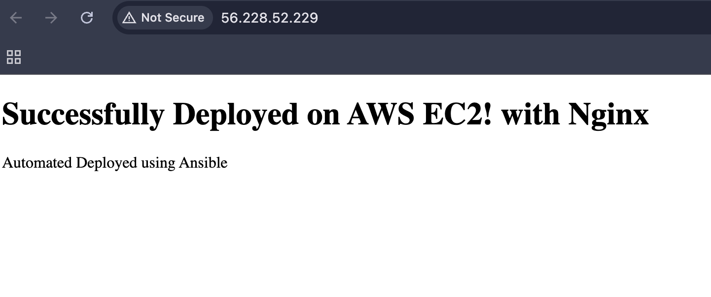
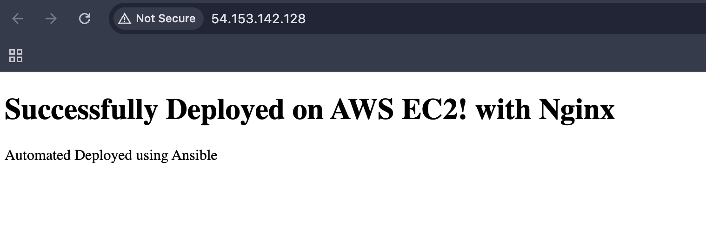
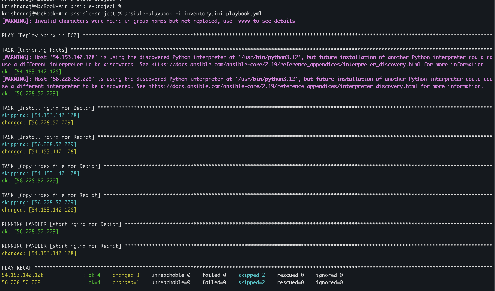
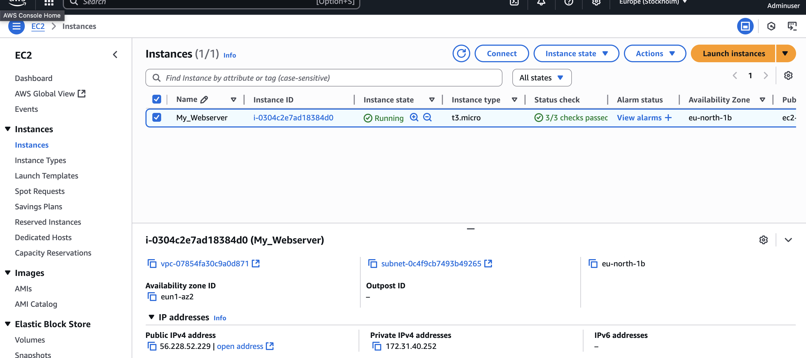
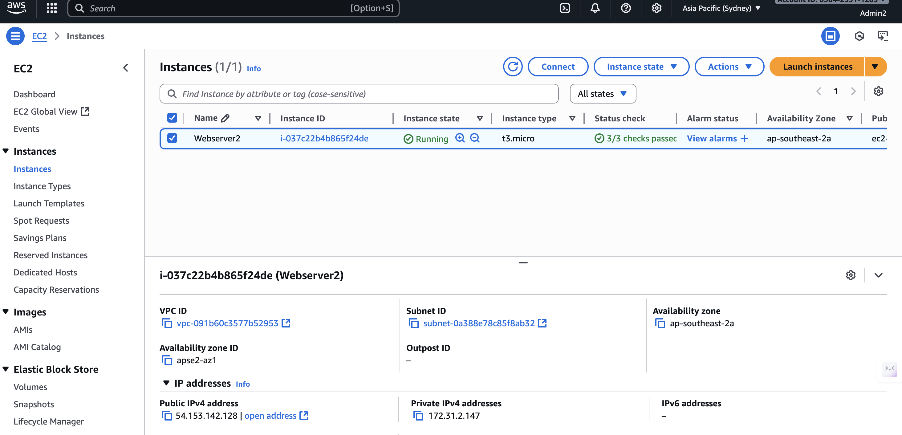

# 🔧 Ansible Automation — Nginx Deployment + Monitoring Stack (Prometheus & Grafana)

## 🧩 Overview
This project automates Nginx deployment and adds a full monitoring stack using Node Exporter, Prometheus, and Grafana. It’s built with OS-specific Ansible roles, version-pinned binaries, and production-style directory structure — making it modular, reusable, and scalable.

---

## ⚙️ What This Project Automates

### 1) Nginx Deployment
- Installs and configures Nginx on Debian + Red Hat EC2s
- Pushes custom HTML page
- Ensures service is running & enabled

### 2) Monitoring Stack

Each component runs via Ansible roles:

- **Node Exporter** collects system metrics from all servers
- **Prometheus** scrapes and stores metrics from Node Exporter
- **Grafana** visualizes Prometheus data with dashboards
- Fully automated setup and service configuration
---

### 🧩 Monitoring Components

| Component       | Purpose                                |
|-----------------|------------------------------------------|
| Node Exporter   | Exposes system metrics from each EC2     |
| Prometheus      | Scrapes + stores metrics                 |
| Grafana         | Visualizes metrics via dashboards        |

---

## 📁 Project Structure

```bash
ansible-project/
│
├── inventory.ini
├── playbook.yml              # Original Nginx automation
├── monitoring.yml            # Monitoring stack automation
│
├── roles/
│   ├── node_exporter/
│   ├── prometheus/
│   └── grafana/
│
├── index.html
├── screenshots/
│   ├── Debian_server.png
│   ├── Redhat_server.png
│   ├── Playbook_run.png
│   └── ...
│
└── README.md
```
---
## 🚀 Quick Start

To run the automation:

### Deploy Nginx
```bash
ansible-playbook -i inventory.ini playbook.yml
```
### Deploy Monitoring Stack
```bash
ansible-playbook -i inventory.ini monitoring.yml
```
---
## 📝 Requirements

### Infrastructure Prerequisites
- Two EC2 instances (one Debian-based, one Red Hat-based) already running
- VPC Peering connection established between both VPCs
- Security Groups configured to allow private VPC-to-VPC traffic on:
  - Port 9100 (Node Exporter metrics)
  - Port 9090 (Prometheus server)
  - Port 22 (SSH access)
  - To access Grafana (no public exposure), use port forwarding:
   `ssh -L 3000:localhost:3000 ubuntu@<debian-ip>`
### Ansible Control Machine
- `ansible-core` installed
- SSH access configured to both EC2 instances
- Private key files available and paths matching `inventory.ini`

### Before You Start
- Node Exporter, Prometheus, and Grafana are fully automated by Ansible roles.  
- Infrastructure tasks (VPC peering, SGs, EC2 provisioning) are done manually for now — Terraform support is planned.

---

## 🧠 How It Works

### Step 1: Inventory
Defines all target hosts with connection details using **Elastic IPs** for consistent access.
```ini
[web-servers]
# Debian-based EC2
56.228.52.229 ansible_user=ubuntu ansible_ssh_private_key_file=~/downloads/MY_Key.pem
# Red Hat-based EC2
54.153.142.128 ansible_user=ec2-user ansible_ssh_private_key_file=~/downloads/Red_Key.pem
```

### Step 2: Modular Playbooks
- `playbook.yml` handles Nginx deployment
- `monitoring.yml` handles Node Exporter + Prometheus + Grafana
- Each tool is isolated into roles: `roles/node_exporter`, `roles/prometheus`, `roles/grafana`

### Step 3: Roles

All roles include:
- `defaults/` → version, paths, runtime variables
- `tasks/` → Debian + RedHat support
- `templates/` → service files + config files
- `handlers/` → safe reload + restart

### 🧩 Monitoring Components (What each tool does)
1. Node Exporter installed on Debian + RedHat
2. Prometheus installed on Debian, scraping both instances
3. Grafana installed on Debian, pulling data from Prometheus
4. Access securely via SSH tunnel:
```bash
ssh -L 3000:localhost:3000 ubuntu@<debian-ip>
```

---

## 🖼️ Nginx Automation — Proof 

Deployment confirmation and web server status:
- [Debian EC2](http://56.228.52.229)
- [Red Hat EC2](http://54.153.142.128)

### Screenshots

- Debian EC2 Webpage: 
- Red Hat EC2 Webpage: 
- Playbook Run: 
- Debian EC2 Web-server: 
- Red Hat EC2 Web-server: 

- Grafana Dashboard Overview:
 
  
- Instance selector:


- Prometheus Targets UP:


---

## 🚀 Next Steps

- Add Terraform to provision EC2 instances, security groups, and VPCs
- Containerize Prometheus and Grafana with Docker
- Build CI/CD pipeline with GitHub Actions for automated deployments

---

## 🎯 Purpose of This Project

- Real-world Ansible automation
- Monitoring setup from scratch
- Production-style directory design
- Reusable configuration (version-controlled, parameterized, scalable)

> 📘 Full step-by-step documentation is being added under /docs. Current repository includes the complete automation logic and production-ready Ansible roles.

> **Goal:** Learn while building, document the process, and showcase hands-on DevOps and cloud skills.