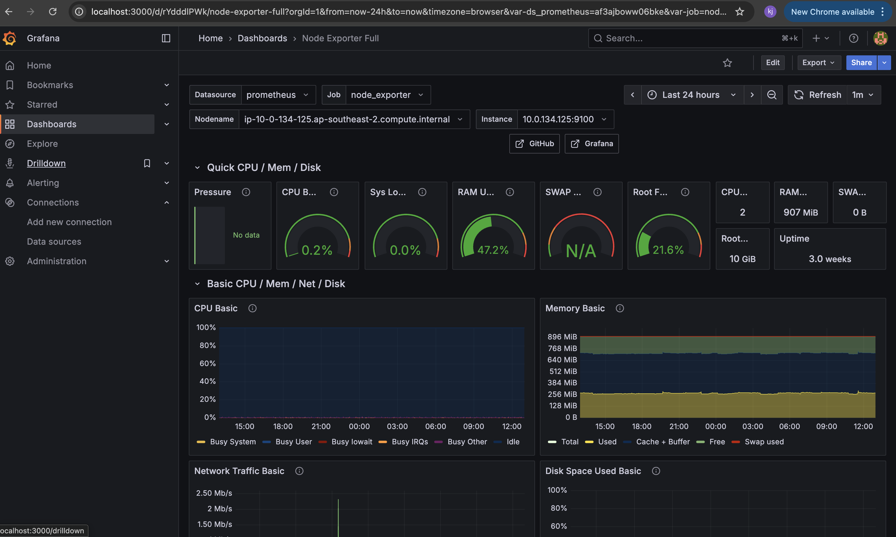
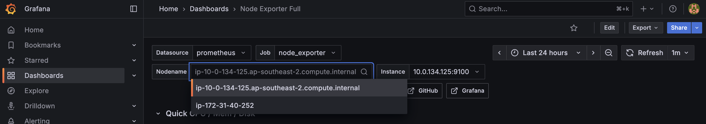
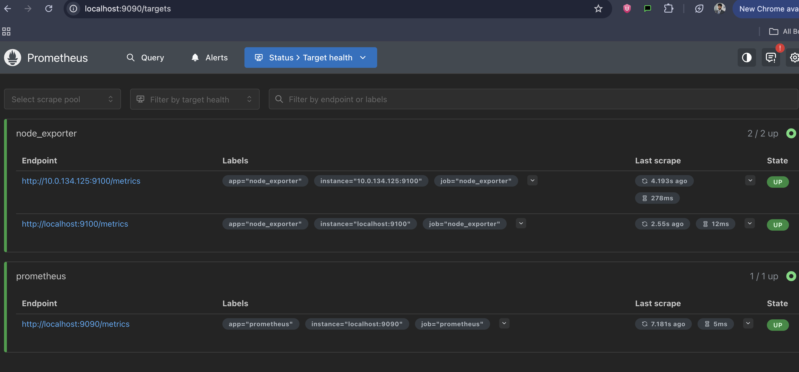

# 🧠 Monitoring Setup — Prometheus + Grafana
> Part of the **AWS EC2 + Nginx Automation Series**, extending the setup with monitoring tools (Prometheus & Grafana).

This setup adds **real-time monitoring** to the AWS EC2-based Nginx project using **Prometheus** and **Grafana**.

Prometheus collects system metrics (CPU, memory, disk, network) from **Node Exporter** running on two EC2 instances:
- 🖥️ **Debian EC2** — hosts **Prometheus** and **Grafana**
- 🔗 **Red Hat EC2** — runs **Node Exporter** (remote monitoring target)

---

## ⚙️ Architecture Overview
The following diagram illustrates how the components communicate across two EC2 instances through a private VPC connection.

```
[ Debian EC2 ]  <– Prometheus (9090), Grafana (3000)
│
(VPC Peering)
│
[ Red Hat EC2 ] <– Node Exporter (9100)
```
- **Node Exporter:** Collects host metrics on each instance  
- **Prometheus:** Scrapes metrics from both instances  
- **Grafana:** Visualizes Prometheus data via dashboards  
- **VPC Peering:** Enables secure, private communication between instances  

---

## 📁 Project Structure

```bash
nginx-aws-project/
│
├── monitoring/
│   ├── prometheus.yml                # Prometheus configuration file
│   ├── README.md                     # Main monitoring summary (this file)
│   └── grafana/
│       └── screenshots/
│           ├── grafana-dashboard-overview.png
│           ├── grafana-instance-selector.png
│           └── prometheus-targets-up.png
│
└── docs/
    └── 3-monitoring-setup.md         # Full setup guide (detailed walkthrough)
```

---

## 🧩 Key Configuration

### 🔹 Prometheus Scrape Targets 
This project uses a minimal version of the default config with a custom node_exporter job added.

📄 Prometheus Config:[prometheus.yml](prometheus.yml)— Defines scrape targets for both Node Exporter instances.

**file**(`/etc/prometheus/prometheus.yml`)
```yaml
- job_name: "node_exporter"
  scrape_interval: 10s
  static_configs:
    - targets: ["localhost:9100", "10.0.134.125:9100"]
```

### 🔹 Grafana Setup
- Added Prometheus as the data source (`localhost:9090`)
- Imported **Node Exporter Full Dashboard (ID: 1860)**
- Visualized metrics for both EC2 instances
  
### 📸 Screenshots
🖥️ **Grafana Dashboard Overview**  
  
_Grafana dashboard overview showing CPU, memory, disk, and network panels for the selected instance._

📊 **Instance Selector**  
  
_Instance selector dropdown showing both Debian & Red Hat instances._

🎯 **Prometheus Targets UP**  
  
_Prometheus “Targets” page showing both node_exporter endpoints as UP (localhost:9100 and 10.0.134.125:9100)._


### 🚀 Outcome
✅ Real-time visibility into CPU, memory, disk, and network performance

✅ Cross-VPC monitoring using secure VPC peering

✅ Grafana dashboard with instance-level metric visualization

✅ No public port exposure — accessed via secure SSH tunnel:
```
ssh -L 3000:localhost:3000 ubuntu@<Debian-Public-IP>
```
---

### 🪜 Next Steps

This project marks the completion of a full monitoring setup using **Prometheus**, **Grafana**, and **Node Exporter** across multiple EC2 instances.

Moving forward, the plan is to continue expanding this architecture by introducing automation, containerization, and scalable cloud-native practices.  
Some of the ideas being explored include:

- Automating monitoring deployment using **Ansible**  
- Defining infrastructure as code with **Terraform**  
- Experimenting with **Docker** for containerized monitoring stacks  
- Setting up **CI/CD pipelines** for continuous deployment  
- Exploring **Kubernetes (EKS)** for scalable orchestration

These improvements will be implemented and documented progressively in future updates.

---
### 📖 Full Walkthrough

For the complete step-by-step setup guide, including installation commands, configurations, and validation:
➡️ See [/docs/3-monitoring-setup.md](/docs/3-monitoring-setup.md)


> 🧭 Each milestone (Ansible automation, Monitoring, etc.) will be documented in the `/docs` directory as the project evolves.
